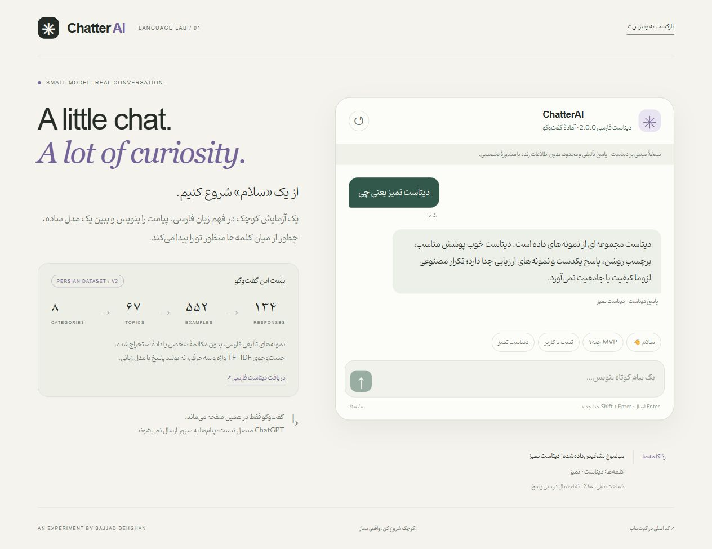
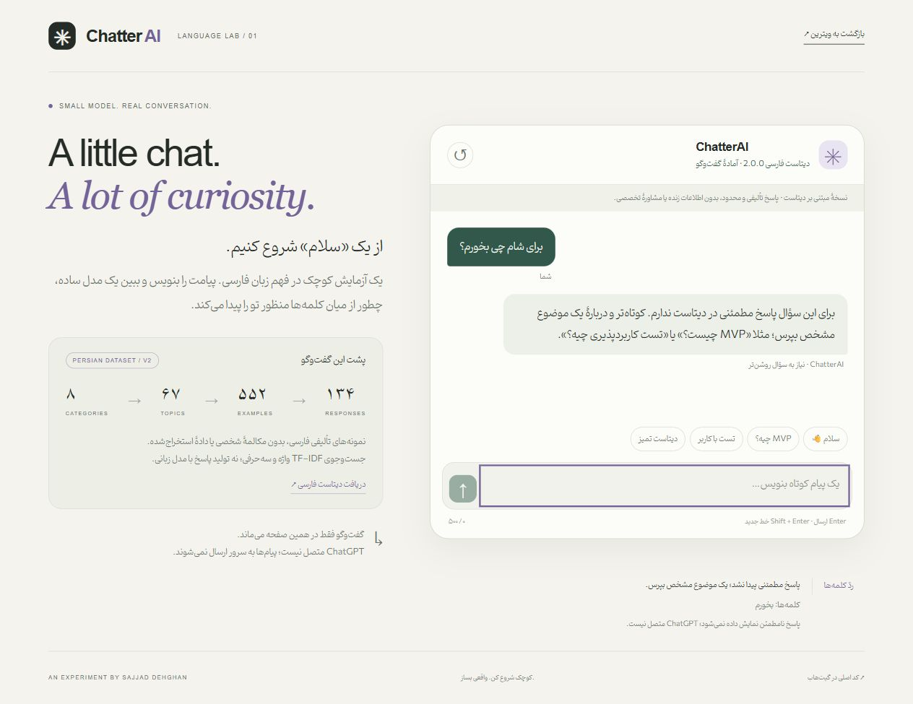
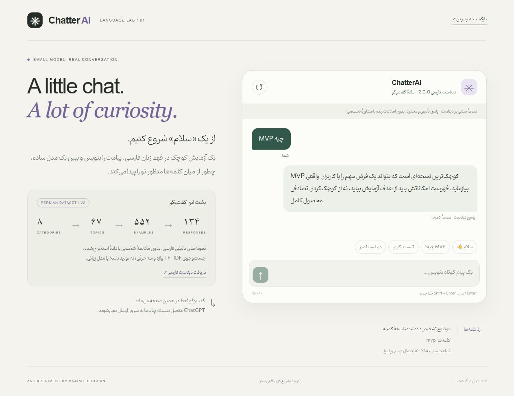

# ChatterAI

## Browser retrieval gallery




Actual browser captures, 2026-10-07. The browser edition uses the authored 67-topic Persian corpus, not the historical neural model or ChatGPT fallback described below. It does not provide unrestricted knowledge or retain messages beyond page memory. [Sectioned showroom](https://sajjad-dehghan-personal-site.prisoner-sedwna.workers.dev/projects/chatterai).

An intent-classification chatbot for **Persian** text. It uses a Bag-of-Words neural network or an Embedding + LSTM model, and when neither model finds a matching intent it can fall back to ChatGPT. A command-line menu lets you build the intent dataset, train a model and chat with it.

## Features

- **Two intent classifiers, built with TensorFlow/Keras:**
  - **Bag of Words:** a dense network (128 → 64 → softmax, with dropout) trained with SGD on binary bag-of-words vectors.
  - **Embedding + LSTM:** a Keras `Tokenizer`, padded sequences (length 20), a 30-dimension `Embedding`, an `LSTM(256)` layer and a softmax output, trained with Adam.
- **Persian text preprocessing** with [hazm](https://github.com/roshan-research/hazm): standard and informal normalization, sentence and word tokenization, and lemmatization.
- **Confidence threshold:** an intent is used only if its predicted probability is above 0.20. The bot then replies with a random response from that intent.
- **ChatGPT fallback (optional):** if no intent passes the threshold, the message is sent to `gpt-3.5-turbo` through the legacy `openai` 0.28 SDK. If that call fails, the bot replies with a fixed Persian message saying no suitable answer was found.
- **Dataset editor** (CLI) for intent JSON files: create a file, add tags, add patterns and responses, and view them.
- **CSV labeling helper:** go through a `user`/`operator` conversation CSV one row at a time and assign each user message to a tag. Your position is saved, so you can resume later.
- **Included data and models:** sample intent files (`bag`, `weight`, `food`) with their trained `.h5` models and pickled vocabularies and tokenizers.

## Requirements

- Python 3.8–3.10 (TensorFlow 2.10 and pandas 2.0.3 require these versions)
- The dependencies in `requirements.txt`: `hazm`, `tensorflow`, `pandas`, `openai==0.28.0`, `numpy`, `scipy`

## Getting Started

```bash
git clone https://github.com/sedwna/ChatterAI.git
cd ChatterAI
pip install -r requirements.txt
cd src          # the app reads and writes data using ../ paths, so start it from src/
python main.py
```

### ChatGPT fallback (optional)

`src/chatgpt.py` contains a placeholder key (`openai.api_key = "####"`). To turn the fallback on, put your own OpenAI API key there in your local copy, and don't commit it. Without a key, the bot still answers every message that matches an intent.

## Usage

When the app starts, it asks for the name of an intent file in `json_file/`, without the `.json` extension (for example `bag`). If the file doesn't exist, it offers to create it. Then choose an option from the menu:

| Option | Action |
| --- | --- |
| `1` | List the tags |
| `2` | Add a tag |
| `3` | Add responses to a tag |
| `4` | Add patterns to a tag |
| `5` | Show a tag's patterns |
| `6` | Show a tag's responses |
| `8` | Label messages from `csv_file/<name>.csv` into tags |
| `9` | Train a model (`1` = Bag of Words, `2` = LSTM) |
| `10` | Chat with the bot (`1` = Bag of Words, `2` = LSTM) |
| `-1` | Exit |

When you train on `<name>.json`, the app saves:

- `chat_bot_model/<name>_model.h5`
- `pkl_file/<name>_words.pkl` and `pkl_file/<name>_classes.pkl`
- `pkl_file/<name>_tkn.pkl` (LSTM model only)

To chat, pick the same model type you trained on that file. The included files are set up like this: `bag` uses Bag of Words, while `weight` and `food` use LSTM.

### Intent file format

```json
{
  "intents": [
    {
      "tag": "greeting",
      "patterns": ["سلام", "سلام وقت شما بخیر"],
      "responses": ["سلام", "سلام چطور میتونم کمکتون کنم؟"]
    }
  ]
}
```

## Project Structure

```
ChatterAI/
├── src/
│   ├── main.py        # CLI menu entry point
│   ├── app.py         # Intent JSON editor and CSV labeling helper
│   ├── nlp.py         # hazm-based normalization, tokenization and lemmatization
│   ├── training.py    # Bag-of-Words and Embedding+LSTM trainers
│   ├── chatbot.py     # Intent prediction, response selection and chat loop
│   └── chatgpt.py     # Optional ChatGPT fallback (openai 0.28)
├── json_file/         # Intent datasets: bag.json, weight.json, food.json
├── chat_bot_model/    # Trained Keras models (.h5)
├── pkl_file/          # Pickled vocabularies, classes and tokenizers
├── csv_file/counter/  # Resume positions for the CSV labeling helper
└── requirements.txt
```

## Tech Stack

- Python
- TensorFlow / Keras (Dense and LSTM models)
- hazm (Persian NLP)
- NumPy, pandas
- OpenAI Python SDK 0.28 (optional fallback)

## Persian browser interface (2026-10-07)



[Try the browser edition](https://sajjad-dehghan-personal-site.prisoner-sedwna.workers.dev/demos/chatter-ai/).

The `web/` frontend is dependency-free HTML/CSS/JavaScript, with a Persian RTL chat, suggested messages, a fresh-conversation control, a downloadable dataset, and a view of recognized words, intent and textual-similarity score. This is a real running UI capture, not an illustrative mockup.

### Curated Persian dataset v2

The active chat loads `web/dataset.json`: **67 intents, 552 distinct example questions and 134 consistent answers in 8 categories** (conversation, assistant, work, product, design, development, ML and boundaries). The examples are original AI-assisted authored text, not scraped conversations or personal data. New corpus text is CC0-1.0; the original application and font are not relicensed.

`web/retriever.mjs` selects an existing answer with word/character TF-IDF matching. Uncertain, mixed-topic and unrelated questions request clarification. It is not an unrestricted LLM, live-information service or multi-turn reasoning engine. Read the [dataset card](web/DATASET.md) for the exact schema, thresholds and limits. The same expanded corpus is supplied at `json_file/conversation-v2.json` for future Python training; it is not compatible with the old four-class weights without retraining.

Regenerate with `node scripts/build-dataset.mjs` and validate with `node --test web/tests/*.test.mjs` (Node.js 22+). Tests cover all indexed examples, 67 separate development paraphrases, unrelated and ambiguous questions, input normalization, boundaries and original Dense inference. Development cases were used during refinement; passing them is not a blind accuracy benchmark.

The original trained Dense export remains in `web/model.json` with regression code in `web/engine.mjs` (28 → 128 → 64 → 4). Its H5 SHA-256 is `b5f109b893967836b1e3f3fb9263410fced08cd8beebf53cd8babbaf239245d1`. It is archived for reproducibility and **not used by the active v2 chat**. No original Python model was overwritten or retrained.

### Run locally

From this repository root, run `python -m http.server 8080`, then open `http://localhost:8080/web/`. Use HTTP rather than opening the HTML file directly because model loading uses `fetch`. No TensorFlow installation or API key is needed for this browser edition. The original Python run instructions above are unchanged.

### Deliberate limits

- Browser Persian normalization is a lightweight Unicode/token alias layer, not a complete Hazm port.
- The new corpus removes the historical sample names and conflicting support promises. It provides bounded, authored responses and declines live data or professional advice.
- Displayed similarity is not a probability of correctness. Match score, distinct-intent margin and content-word coverage must meet documented gates.
- LSTM and ChatGPT are **not connected** in this browser edition. No external chat API is called. Messages remain only in the current page memory and disappear after reload/reset; no local storage is used.
- The original Python source, datasets, pickles and H5 models remain unchanged; the new v2 corpus, frontend, documentation and tests are separate additions.
